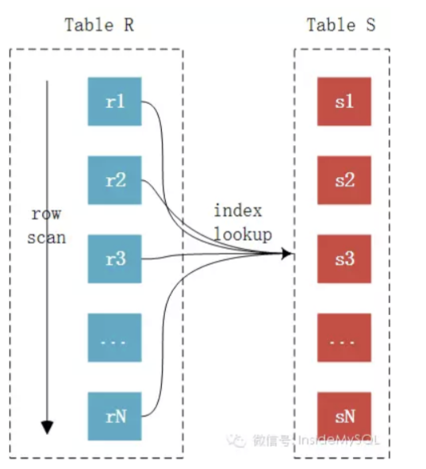
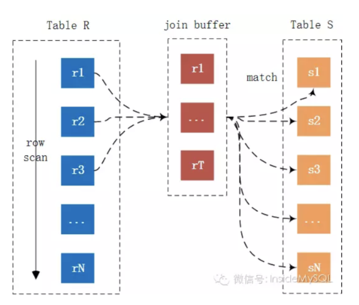

---
layout:     post
title:      SQL优化 
subtitle:   explain命令详解
date:       2019-06-14
author:     HDD
header-img: img/post_bg_shell.png
catalog: true
tags:
    - MySQL
--

# explain命令
```mysql
explain show warning
```
```mysql
explain select * from goods g left join product p on g.product_id = p.id;
```
|id|select_type|table|partitions|type|possible_keys|key|key_len|ref|rows|filtered|Extra|
|---|---|---|---|---|---|---|---|---|---|---|---|
|1|SIMPLE|g|null|ALL|null|null|null|null|4689|100|null|
|1|SIMPLE|p|null|eq_ref|PRIMARY|PRIMARY|8|sku.g.product_id|1|100|null|

**id**: 决定表的读取顺序 执行select 语句查询的序列号,包含一组数字,表示查询中执行select子句或操作表的顺序 它有三种情况: 
1. id相同，执行顺序由上至下
2. id不同，如果是子查询，id的序号会递增，id值越大优先级越高,越先被执行
3. id相同、不同，同时存在，如果id相同，可以认为是一组，从上往下顺序执行,在所有组中，id值越大，优先级越高，越先执行

**select_type**: 查询的类型，也就是数据读取操作的操作类型，他一共有以下5种:
1. `simple`: 简单的select查询,查询中不不包含子查询或者union
2. `primary`: 查询中若包含任何复杂的子查询,最外层查询则被标记
3. `subquery`: 在select或者where列表中包含了子查询
4. `derived`: 在from列表中包含的子查询被标记为 DERIVED(衍生表),mysql会递归执行这些子查询,把结果放临时表中
5. `union`: 若第二个select出现在union 之后,则被标记为union,若union包含在from子句的子查询中,外层select将被标记为:DERIVED; union result:从union表
(即union合并的结果集)中获取select查询的结果

**type**: 访问类型排列列 显示查询使用了何种类型,从最好到最差依次是:system > const > eq_ref > ref > range > index > all 
1. `system`: 表只有一行记录(等于系统表),这是const类型的特例,平时不不会出现,这个也可忽略不计
2. `const`: 表示通过索引一次就找到了，const用于比较primary key或者unique索引。因为只匹配一行记录,所以很快. 如果将主键置于where列列表中,mysql就能将该查询转换成一个常量量 
3. `eq_ref`: 唯一性索引扫描,对于每一个索引键,表中只有一条记录与之匹配,常用于主键或唯一索引扫描
4. `ref`: 非唯一性索引扫描,返回匹配某个单独值得所有行,本质上也是一种索引访问,它返回所有匹配某个单独值的行,然而,它可能会找到多个符合条件的⾏行行,所以它应该属于查找和扫描的混合体
5. `range`: 只检索给定范围的行,使⽤用一个索引来选择行,key列显示使用哪个索引,一般就是在你的where语句中出现了between,<,>,in等的查询;这种范围索引扫描比全表扫描要好,
因为它只需要开始于索引的某一个点,结束于另一个点,不用扫描全部索引
6. `index`: index于all区别为index类型只遍历索引树,这通常比all快,因为索引文件通常比数据文件小，也就是说虽然all和index都是读写表,但index是从索引中读取的，而all是从硬盘中读的; 
7. `all`: 也就是全表扫描

**备注: 一般来说,得保证查询至少达到range级别,最好能达到ref**

**possible_keys**: 显示可能会被应用到这张表的索引,一个或者多个;查询涉及到的字段上若存在索引,则该索引将被列出,但不一定被查询实际使用到;

**key**: 实际使用到的索引.如果为null,则没有使用索引;查询中若使用了覆盖索引,则该索引仅出现在key列表中;

**key_len**: 表示索引中使用的字节数,可通过该列计算查询中使用的索引的长度,在不损失精确性的情况下, 长度越短越好; key_len显示的值为索引字段的最大可能长度,并非实际使用长度,
即key_len是根据表定义计算而得,不是通过表内检索出的;

**ref**: 显示索引的那一列被使用了,如果可能的话,是一个常数,哪些列或常量别用于查找索引列上的值;

**rows**: 根据表统计信息及索引选用情况,大致估算出找到所需的记录所需要读取的行数;

**filtered**: 使用explain extended时会出现这个列，5.7之后的版本默认就有这个字段，不需要使用explain 
extended了。这个字段表示存储引擎返回的数据在server层过滤后，剩下多少满足查询的记录 数量量的比例

**Extra**: 包含不适合在其它列中显示但十分重要的额外信息: 
1. `using filesort`(出现这个东西不好): 说明mysql会对数据使用一个外部的索引排序,而不是按照表内的索引顺序进行读取,mysql中无法利用索引完成的排序操作称为"文件排序";
2. `using temporary`(出现这个东西更不好,使用到了临时表): 使用了临时表保存中间结果,Mysql在对查询结果排序时使用临时表,常见于排序order by和分组查询group by
3. `using index`: 表示相应的select操作中使用了覆盖索引(Covering Index),避免了访问了表的数据行,效率不错!如果同时出现using where ,
表明索引被用来执行索引键值的查找;如果没有同时出现using where, 表明索引用来读取数据而非执行查找操作;
4. `using where`: 使用了where
5. `using index condition`: 使用了 5.6 新特性 ICP(index condition pushdown)
6. `using join buffer`: 使用了链接缓存
7. `impossible where`: where子句的值总是false,不能用来获取任何元素
8. `select tables optimized away`: 在没有group by子句的情况下,基于索引优化MIN/MAX操作或者对于 MyISAM存储引擎优化count(*)操作,不必等到执行阶段再进行计算,
查询执行计划生成的阶段即完成优化
9. `using mrr`: 

**覆盖索引**:
* 理解方式一: 就是select的数据列只用从索引列中就能取得,不必读取数据行,Mysql可以利用索引返回select列表中的字段,而不必根据索引再次读取数据文件,
换句话说查询列要被所建的索引列覆盖; 
* 理解方式二: 索引是高效找到行的一个方法,但是一般数据库也能使用索引找到一个列的数据,因此它不必读取整个行，毕竟索引的叶子节点存储了索引数据;
当能通过读取索引就可以得到想要的数据,那就不需要读取行了;一个索引包含了(或者覆盖了)满足查询结果的数据就叫做覆盖索引。 
* 注意: 如果要使用覆盖索引,一定要注意select列表中只取出需要的列,不可select *;因为如果将所有的字段一起做索引会导致索引文件过大,查询性能下降;

**icp使用限制**:
1. 当sql需要全表访问时,ICP的优化策略可用于range, ref, eq_ref, ref_or_null 类型的访问数据方法 
2. 支持InnoDB和MyISAM表 
3. ICP只能用于二级索引，不能用于主索引
4. 并非全部where条件都可以 用ICP筛选。如果where条件的字段不在索引列中,还是要读取整表的记录到server端做where过滤
5. ICP的加速效果取决于在存储引擎内通过ICP筛选掉的数据的比例
6. 5.6版本的不支持分表的ICP功 能，5.7 版本的开始支持
7. 当sql 使用覆盖索引时，不支持ICP 优化方法

**mrr详解**: 
* 随机 IO 转化为顺序IO以降低查询过程中IO开销的一种手段，这对IO-bound类型的SQL语句句性能带来极大的提升。MRR的优化在于，并不是每次通过辅助索引就回表去取记录，⽽而是将其rowid给缓存起来，然后对rowid
进行排序后，再去访问记录，这样就能将随机I/O转化为顺序I/O，从而大幅地提升性能。

**join 详解**:
* MySQL是只支持一种JOIN算法Nested-Loop Join(嵌套循环链接)，不像其他商业数据库可以支持哈希链接和合并连接，不过MySQL的Nested-Loop Join(嵌套循环链接)
也是有很多变种，能够帮助MySQL更高效的执行JOIN操作: 
    1. **Simple Nested-Loop Join**: 这个算法相对来说就是很简单了，从驱动表中取出R1匹配S表所有列，然后R2，R3,直到将R表中的所有 
    数据匹配完，然后合并数据，可以看到这种算法要对S表进行RN次访问，虽然简单，但是相对来说开销还是太大了
    
    2. **Index Nested-Loop Join**: 索引嵌套联系由于非驱动表上有索引，所以比较的时候不再需要一条记录进行比较，而可以通过索引
                                    来减少比较，从而加速查询。这也就是平时我们在做关联查询的时候必须要求关联字段有索引的一个主要原因。
                                    这种算法在链接查询的时候，驱动表会根据关联字段的索引进行查找，当在索引上找到了符合的值，再回表进行查询，也就是只有当匹配到索引以后才会进行回表。至于驱动表的选择，MySQL优化器一般情况下是会选择记录数少的作为驱动表，但是当SQL特别复杂的时候不排除会出现错误选择。
                                    在索引嵌套链接的方式下，如果非驱动表的关联键是主键的话，这样来说性能就会非常的高，如果不是 
                                    主键的话，关联起来如果返回的行数很多的话，效率就会特别的低，因为要多次的回表操作。先关联索 
                                    引，然后根据二级索引的主键ID进行回表的操作。这样来说的话性能相对就会很差。
    
    3. **Block Nested-Loop Join**: 在有索引的情况下，MySQL会尝试去使用Index Nested-Loop Join算法，在有些情况下，可能Join的列 
    就是没有索引，那么这时MySQL的选择绝对不会是最先介绍的Simple Nested-Loop Join算法，而是会优先使用Block Nested-Loop Join的算法。
                                   Block Nested-Loop Join对比Simple Nested-Loop Join多了一个中间处理的过程，也就是join buffer， 
                                   使用join buffer将驱动表的查询JOIN相关列都给缓冲到了JOIN BUFFER当中，然后批量与非驱动表进行 
                                   比较，这也来实现的话，可以将多次比较合并到一次，降低了非驱动表的访问频率。也就是只需要访问 
                                   一次S表。这样来说的话，就不会出现多次访问非驱动表的情况了，也只有这种情况下才会访问join buffer。
                                   在MySQL当中，我们可以通过参数join_buffer_size来设置join buffer的值，然后再进行操作。默认情况 
                                   下join_buffer_size=256K，在查找的时候MySQL会将所有的需要的列缓存到join buffer当中，包括 
                                   select的列，而不是仅只缓存关联列。在一个有N个JOIN关联的SQL当中会在执行时候分配N-1个join buffer <br>
    